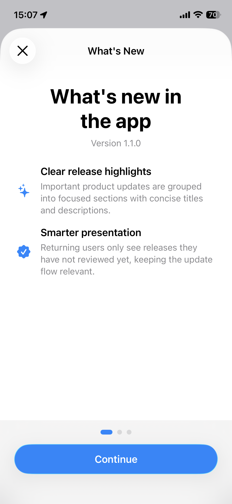
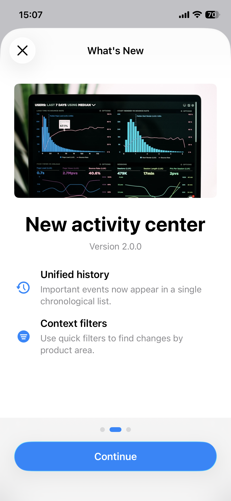
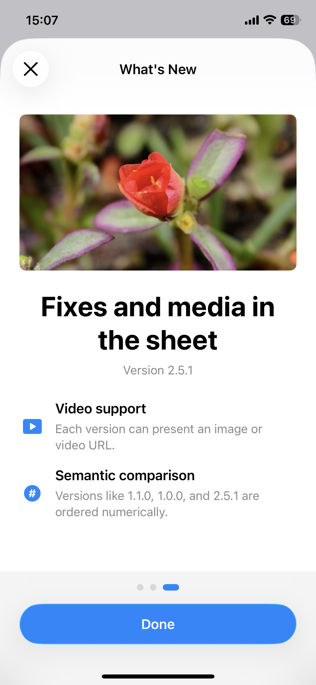

<p align="center">
  
</p>

# WhatsNewKit

<p align="center">
  <strong>A lightweight SwiftUI package for presenting app release highlights.</strong>
</p>

<p align="center">
  
  
  
  
  
</p>

`WhatsNewKit` helps SwiftUI apps present polished "What's New" sheets after an update. Declare the releases your app knows about, attach a view modifier, and the package decides which versions should be shown.

Automatic presentation is controlled by your app through `canPresent`. When that value is `true`, users see every release newer than the last presented version and up to the current app version. When it is `false`, nothing is shown or marked as seen, so the pending release remains eligible for a later evaluation.

<p align="center">
  
  
  
</p>

## Features

- Automatic presentation on app launch.
- Manual presentation from buttons, menus, settings screens, or debug tools.
- Multi-release paging, so users can catch up across skipped versions.
- Image and video media support per release.
- Topic rows with optional SF Symbols or bundled image assets.
- Internal `UserDefaults` storage scoped to the host app bundle.
- Semantic version ordering for values such as `1.1.0`, `2.0.0`, and `2.5.1`.

## Installation

### Swift Package Manager

Add `WhatsNewKit` to your package dependencies:

```swift
dependencies: [
    .package(
        url: "https://github.com/didisouzacosta/WhatsNewKit.git",
        branch: "main"
    )
]
```

Then add the product to the target that presents the sheet:

```swift
.target(
    name: "YourApp",
    dependencies: [
        .product(name: "WhatsNewKit", package: "WhatsNewKit")
    ]
)
```

You can also add the package in Xcode through `File > Add Package Dependencies`.

## Usage

### Automatic Presentation

Attach `.whatsNewSheet(releases:canPresent:)` to the screen that should host the sheet. By default, `WhatsNewKit` reads `CFBundleShortVersionString` from the app bundle. Drive `canPresent` from your own app readiness, such as onboarding completion, authentication state, or the moment your main UI is ready to present a sheet.

```swift
import SwiftUI
import WhatsNewKit

struct HomeView: View {
    @State private var canPresentWhatsNew = false

    private let releases = [
        WhatsNewRelease(
            version: "3.0.0",
            title: "New search experience",
            media: .image(URL(string: "https://images.unsplash.com/photo-1551288049-bebda4e38f71?auto=format&fit=crop&w=1200&q=80")!),
            topics: [
                WhatsNewTopic(
                    title: "Faster results",
                    description: "Search now prioritizes your most-used items.",
                    icon: .systemImage("magnifyingglass.circle.fill")
                )
            ]
        )
    ]

    var body: some View {
        ContentView()
            .whatsNewSheet(
                releases: releases,
                canPresent: canPresentWhatsNew
            )
            .task {
                canPresentWhatsNew = true
            }
    }
}
```

If the last presented version was `2.0.0` and the current app version is `3.0.0`, the sheet presents releases after `2.0.0` through `3.0.0`, ordered by version. If `canPresent` is `false`, the sheet is not presented and `2.0.0` remains the last presented version.

### Presentation Rules

Automatic presentation uses three inputs:

- `canPresent`, provided by the app that integrates `WhatsNewKit`.
- `currentVersion`, read from `CFBundleShortVersionString` by default or passed explicitly.
- `lastPresentedVersion`, stored internally after the user finishes a What's New presentation.

The automatic sheet is shown only when all of these conditions are true:

- `canPresent` is `true`.
- At least one declared release has a version less than or equal to `currentVersion`.
- At least one eligible release is newer than `lastPresentedVersion`, or no version has been presented yet.

These cases do not show the sheet:

- `canPresent` is `false`, even when there is a new eligible version.
- A release version is greater than `currentVersion`.
- The eligible release version was already presented for that user.

When `canPresent` is `false`, `WhatsNewKit` does not mark anything as presented. If `canPresent` later changes to `true`, the framework evaluates the same pending releases again and presents any eligible version that has not already been shown.

### Marking Versions As Seen

If your app needs to skip the current version without presenting the sheet, call `WhatsNewPresentationState.markCurrentVersionAsSeen()`. This records the current app version as already considered without opening a sheet or emitting analytics events.

```swift
import WhatsNewKit

func onboardingDidFinish() {
    WhatsNewPresentationState.markCurrentVersionAsSeen()
}
```

Only call this when your app intentionally wants to suppress the current version. If you only need to delay presentation, keep `canPresent` as `false` until your app is ready.

### Manual Presentation

Use the binding-based modifier when the user should open the sheet from your own UI.

```swift
import SwiftUI
import WhatsNewKit

struct SettingsView: View {
    @State private var showWhatsNew = false

    let releases: [WhatsNewRelease]

    var body: some View {
        List {
            Button("What's New") {
                showWhatsNew = true
            }
        }
        .whatsNewSheet(
            isTriggered: $showWhatsNew,
            releases: releases
        )
    }
}
```

Manual presentation is forced. It ignores first-launch state, the stored last-presented version, and the current app version, then shows every declared release ordered by version. This makes it suitable for settings screens, debug tools, previews, and development workflows.

## Release Model

Each release has a version, a title, optional media, and one or more topics.

Media is declared with a single enum:

```swift
// Local asset image
media: .image("ReleaseHero")

// Local asset image with explicit bundle
media: .image(.asset("ReleaseHero", bundle: .main))

// Local UIImage on UIKit platforms
media: .image(.uiImage(heroImage))

// Remote image URL
media: .image(URL(string: "https://example.com/release.png")!)

// Remote video URL
media: .video(URL(string: "https://example.com/release.mp4")!)
```

```swift
let release = WhatsNewRelease(
    version: "2.5.1",
    title: "Fixes and media in the sheet",
    media: .video(URL(string: "https://interactive-examples.mdn.mozilla.net/media/cc0-videos/flower.mp4")!),
    topics: [
        WhatsNewTopic(
            title: "Video support",
            description: "Each version can present an image or video URL.",
            icon: .systemImage("play.rectangle.fill")
        ),
        WhatsNewTopic(
            title: "Custom icons",
            description: "Use SF Symbols or images from the app bundle.",
            icon: .image("ReleaseIcon")
        )
    ]
)
```

## Version Control

`WhatsNewKit` stores presentation state internally with `UserDefaults`. Apps do not need to provide their own storage implementation.

For previews, tests, or custom rollout logic, pass an explicit `currentVersion`:

```swift
.whatsNewSheet(
    releases: releases,
    canPresent: userCanSeeWhatsNew,
    currentVersion: "3.0.0"
)
```

The same parameter is available on the manual trigger modifier.

## Analytics Events

Pass `onEvent` to track sheet presentation and step progress. Video media starts automatically when its page becomes active and pauses when the page disappears.

```swift
.whatsNewSheet(
    releases: releases,
    onEvent: { event in
        switch event {
        case let .opened(presentation):
            analytics.track("whats_new_opened", ["versions": presentation.id])
        case let .closed(presentation):
            analytics.track("whats_new_closed", ["versions": presentation.id])
        case let .stepProgress(release, index, count):
            analytics.track("whats_new_step", [
                "version": release.version,
                "step": index + 1,
                "total": count
            ])
        }
    }
)
```

## Demo App

Open `Demo/WhatsNewKitDemo.xcodeproj` to run a sample app that imports this package locally. The demo includes:

- automatic presentation on app launch;
- manual presentation from a list button;
- multiple release pages;
- image and video media examples;
- autoplaying video media;
- analytics event callbacks;
- topic rows with SF Symbols.

## Inspiration

This package is inspired by [SvenTiigi/WhatsNewKit](https://github.com/SvenTiigi/WhatsNewKit), a mature Swift package for showcasing new app features. This implementation keeps the public surface small and focuses on a SwiftUI-first release notes flow for this project.

## License

`WhatsNewKit` is available under the MIT license. See [LICENSE](LICENSE) for details.

---

<p align="center">
  <strong>WhatsNewKit</strong>
  <br>
  SwiftUI release notes, version-aware presentation, and a small API surface.
</p>

<p align="center">
  <a href="#installation">Installation</a>
  ·
  <a href="#usage">Usage</a>
  ·
  <a href="#release-model">Release Model</a>
  ·
  <a href="#demo-app">Demo App</a>
  ·
  <a href="#license">License</a>
  ·
  <a href="https://github.com/SvenTiigi/WhatsNewKit">Original Inspiration</a>
</p>
