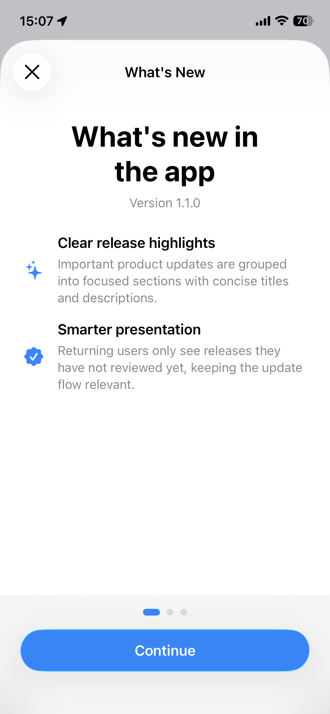
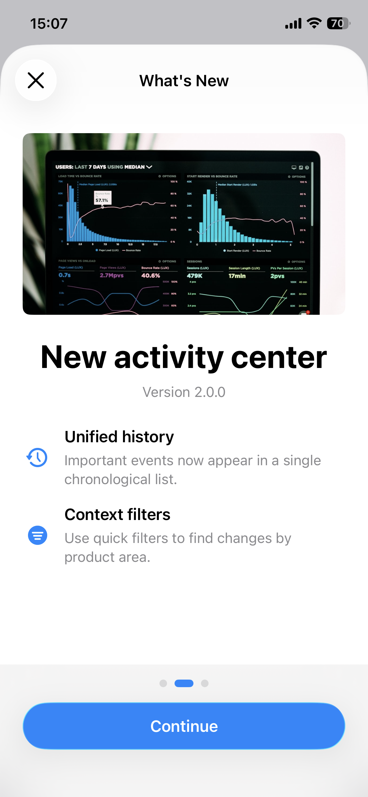
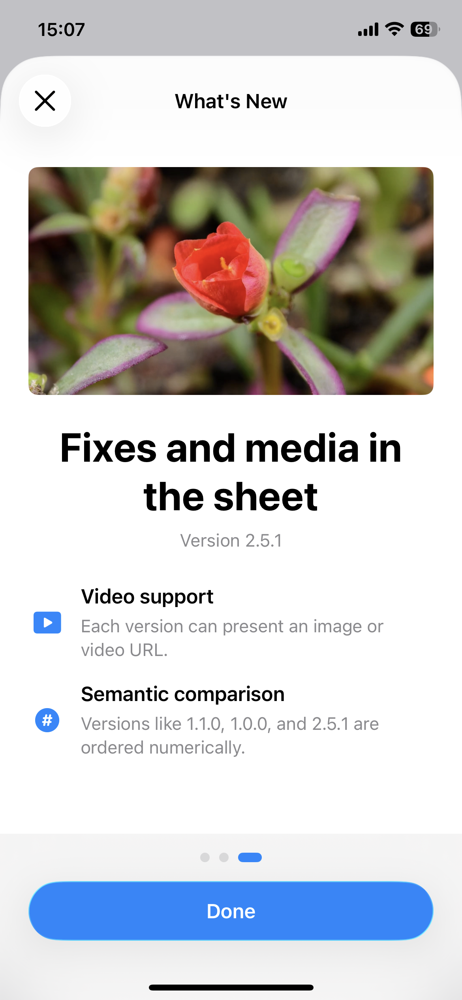

<p align="center">
  
</p>

# WhatsNewKit

<p align="center">
  <strong>A lightweight SwiftUI package for presenting app release highlights.</strong>
</p>

<p align="center">
  
  
  
  
  
</p>

Declare your releases, attach a view modifier, and `WhatsNewKit` shows each user the releases they haven't seen yet.

<p align="center">
  
  
  
</p>

## Features

- Automatic presentation after updates, manual presentation from your own UI.
- Paging across every skipped release.
- Image or video media per release, topics with SF Symbols or bundled images.
- Semantic version ordering, including pre-releases (`2.0.0-beta.1`).
- Built-in `UserDefaults` storage, with optional custom suite.

## Installation

Add the package in Xcode (`File > Add Package Dependencies`) or in `Package.swift`:

```swift
.package(url: "https://github.com/didisouzacosta/WhatsNewKit.git", branch: "main")
```

```swift
.product(name: "WhatsNewKit", package: "WhatsNewKit")
```

## Usage

### Declare releases

```swift
let releases = [
    WhatsNewRelease(
        version: "3.0.0",
        title: "New search experience",
        media: .image(URL(string: "https://example.com/search.png")!),
        topics: [
            WhatsNewTopic(
                title: "Faster results",
                description: "Search now prioritizes your most-used items.",
                icon: .systemImage("magnifyingglass.circle.fill")
            )
        ]
    )
]
```

Media options:

```swift
media: .image("ReleaseHero")                           // asset
media: .image(.asset("ReleaseHero", bundle: .main))    // asset in a bundle
media: .image(.uiImage(heroImage))                     // UIImage (UIKit platforms)
media: .image(URL(string: "https://…/release.png")!)   // remote image
media: .video(URL(string: "https://…/release.mp4")!)   // remote video, autoplays
```

Topic icons use `.systemImage("…")` or `.image("…")`.

### Automatic presentation

```swift
struct HomeView: View {
    @State private var canPresentWhatsNew = false

    var body: some View {
        ContentView()
            .whatsNewSheet(releases: releases, canPresent: canPresentWhatsNew)
            .task { canPresentWhatsNew = true }
    }
}
```

Use `canPresent` to wait until your app is ready (onboarding, login, main UI).

### Manual presentation

```swift
@State private var showWhatsNew = false

Button("What's New") { showWhatsNew = true }
    .whatsNewSheet(isTriggered: $showWhatsNew, releases: releases)
```

Need both on the same screen? Use the combined modifier, which hosts a single sheet:

```swift
.whatsNewSheet(releases: releases, canPresent: canPresentWhatsNew, isTriggered: $showWhatsNew)
```

## Presentation rules

**Automatic**

- **New install:** the installed version is recorded and nothing is shown. Users updating to the first version that adopts `WhatsNewKit` are treated the same way.
- **After an update:** shows every release newer than the last presented version and up to the current app version (`CFBundleShortVersionString`), oldest first.
- **`canPresent == false`:** nothing is shown or recorded; pending releases stay eligible.
- **Closing** with Done, the close button or a swipe records the latest version shown. The stored version never moves backwards.
- The modifier re-evaluates when the view appears and when `canPresent`, `releases` or `currentVersion` change, so releases loaded asynchronously work.

**Manual**

- Shows every declared release, oldest first, ignoring stored state and the current version.
- Records nothing, so it never hides a release from automatic presentation.
- A trigger received while a sheet is already visible is ignored.

**Versions**

- SemVer ordering: pre-releases come before the final version and build metadata (`+42`) is ignored.
- Versions without numeric components (e.g. `"next"`) are ignored.

## Customization

Skip the current version without showing the sheet:

```swift
WhatsNewPresentationState.markCurrentVersionAsSeen()
```

Use a custom store, such as an App Group (pass the same values to both calls):

```swift
let defaults = UserDefaults(suiteName: "group.com.example.app")!

.whatsNewSheet(releases: releases, defaults: defaults, namespace: "com.example.app")

WhatsNewPresentationState.markCurrentVersionAsSeen(defaults: defaults, namespace: "com.example.app")
```

Override the app version for previews or tests with `currentVersion: "3.0.0"`.

Track events with `onEvent`:

```swift
.whatsNewSheet(releases: releases) { event in
    switch event {
    case let .opened(presentation): analytics.track("whats_new_opened", presentation.id)
    case let .closed(presentation): analytics.track("whats_new_closed", presentation.id)
    case let .stepProgress(release, _, index, count): analytics.track(release.version, index + 1, count)
    }
}
```

## Demo

Open `Demo/WhatsNewKitDemo.xcodeproj` for a sample app with automatic and manual presentation, image and video media, and analytics callbacks.

## Development

```sh
swift test
scripts/lint-swift.sh --fix
scripts/lint-swift.sh
```

Linting requires SwiftLint 0.63.2 and SwiftFormat 0.63.0 (`scripts/install-swift-tools.sh`).

## Credits

Inspired by [SvenTiigi/WhatsNewKit](https://github.com/SvenTiigi/WhatsNewKit).

## License

MIT. See [LICENSE](LICENSE).
